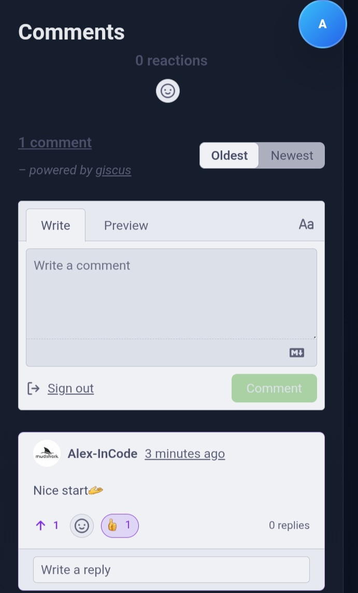

# alex-incode.github.io

🦈 Mudshark
A web project focused on creating useful tools and improving user productivity.

# 📸 Screenshots

## Main Page

Responsive design
Dark/Light mode toggle
Blog section
GitHub-powered comments using Giscus
Project showcase
Skills section
Contact section
Firebase authentication

## Comments Section

Technologies Used
HTML5
CSS3
JavaScript
Firebase
GitHub Pages
Giscus

## Contact Section

## Profile Section

Installation
Clone the repository
git clone https://github.com/Alex-InCode/alex-incode.github.io.git
Open index.html in your browser
📚 Future Plans
More blog posts
Visitor analytics
Search functionality
Portfolio improvements
Additional project pages

👤 Author

Alex-InCode
